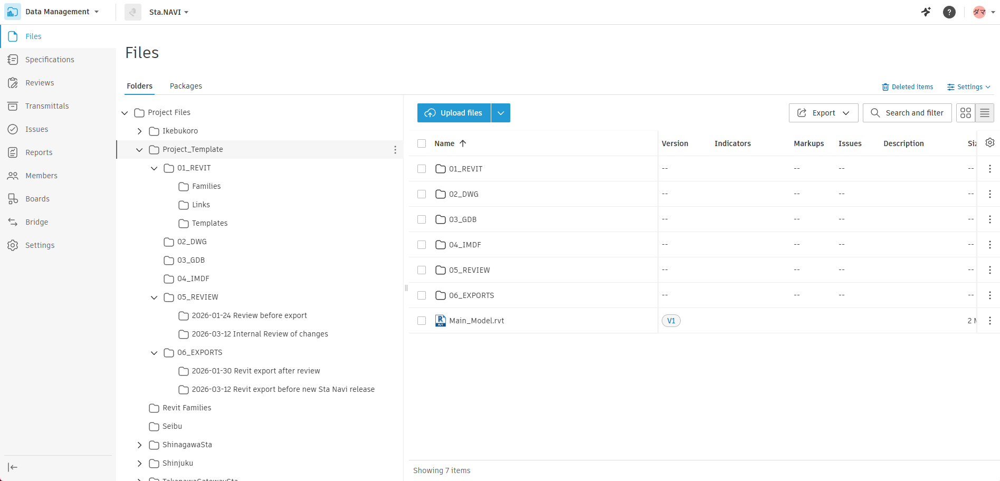

import { Steps, Aside } from "@astrojs/starlight/components";

Our ACC projects follow a consistent folder structure so that every team member
can find what they need without guessing.

## Top-Level Folders and Files

| Folder       | Purpose                                                                |
| ------------ | ---------------------------------------------------------------------- |
| `01_REVIT`   | Revit links, Templates and Families etc.                               |
| `02_DWG`     | All DWG drawings that are not linked inside of the main model          |
| `03_GDB`     | GDB files and files related to GDB                                     |
| `04_IMDF`    | IMDF files and files related to IMDF                                   |
| `05_REVIEW`  | All documents that are currently under review or has been in the past. |
| `06_EXPORTS` | Files sent to people outside of JRC                                    |

| File               | Purpose                                               |
| ------------------ | ----------------------------------------------------- |
| `PROJECT_NAME.RVT` | Main Revit model is placed in the root of the project |

## Example Image

<Aside type="caution">
  Make sure all the folders inside both '05_REVIEW' and '06_EXPORTS' always have
  a YYYY-MM-DD date format to keep these folders organized and also easier to
  compare one review and export to another.
</Aside>
